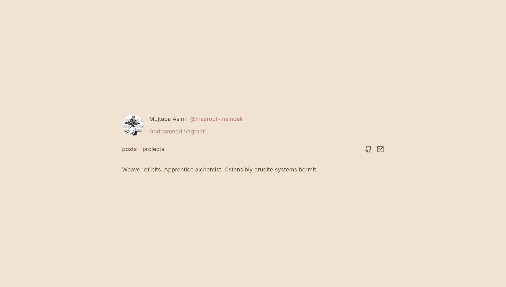
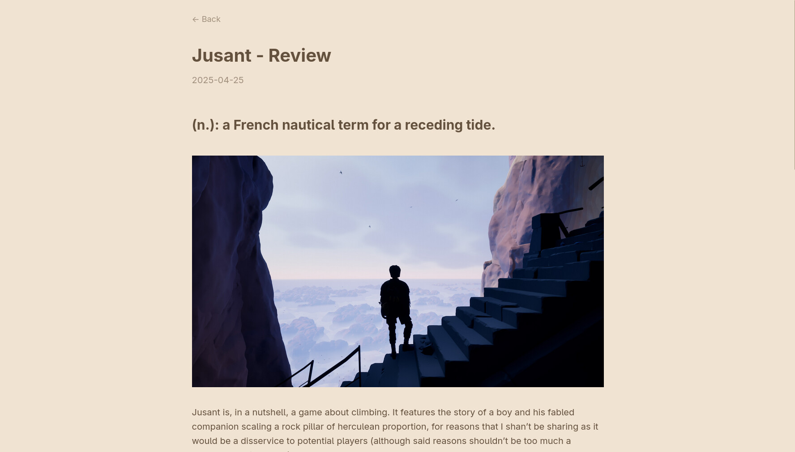
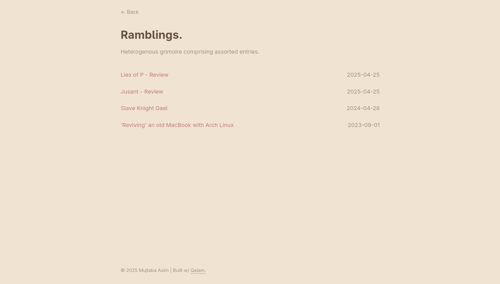
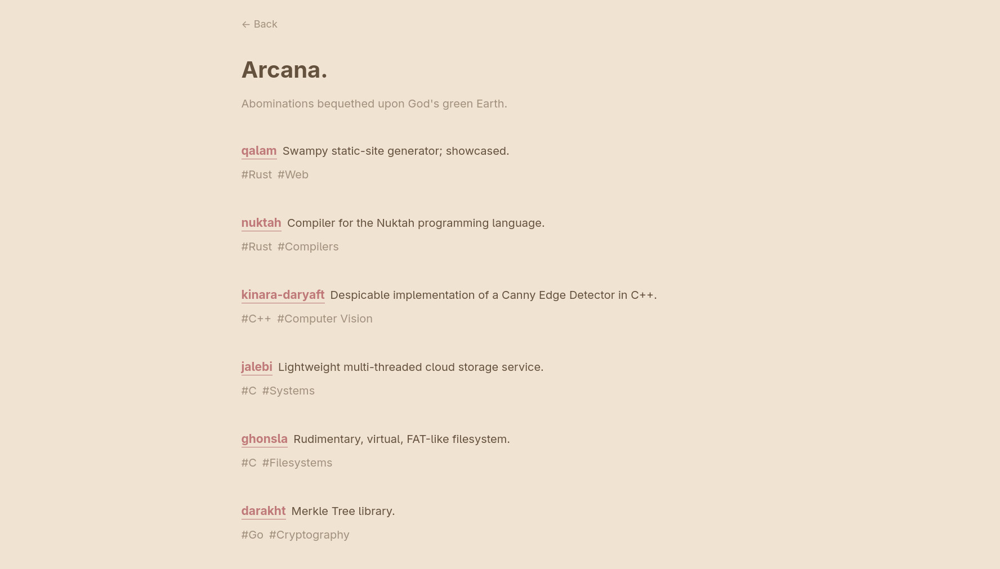

# Qalam

Swampy static site generator.

<p align="center">
  
  
  
  
</p>

## Setup

```bash
git clone https://github.com/masroof-maindak/qalam.git
cd qalam
cargo install --path .
```

## Usage

### Build Site

```bash
# After completing the configuration, and ensuring you have the expected
# directory structure, illustrated hereinafter:

qalam <dir> # '.' by default
```

### GitHub Pages Integration

To auto-build and publish your site to GitHub pages upon pushing to the `main`
branch in your blog's source code repository, add the following file under
`.github/workflows/gh-pages.yml` in your project's root:

```yml
name: Build & Deploy

on:
  push:
    branches: ["main"]

jobs:
  build:
    runs-on: ubuntu-latest
    permissions:
      contents: write
    steps:
      - uses: actions/checkout@v6
      - uses: actions-rust-lang/setup-rust-toolchain@v1
      - run: cargo install qalam-ssg
      - run: qalam
      - uses: peaceiris/actions-gh-pages@v4
        if: github.ref == 'refs/heads/main'
        with:
          github_token: ${{ secrets.GITHUB_TOKEN }}
          publish_dir: ./build
```

Then, in the repository's Settings menu, under the 'Pages' section , configure
the 'Branch' to be `gh-pages`, and serve it from '/'.

## Development

Note that it is essential that the project is run from the program root while in
debug mode (e.g w/ `cargo run <dir>`). This is required because of the splendid
`rust-embed` crate, that allows us to 'bake in' the required theme files into
the output binary.

## Configuration

### `./index.toml`

```toml
page_title = "My Site"
name = "John Doe"
username = "@john-doe"
bio = "Phrase describing you."
email = "john.doe@gmail.com"
github = "https://github.com/your-profile"
desc = "Brief paragraph about you."
footer = "© 2025 John Doe"
theme_name = "swamp-light"
```

### `./posts.toml`

```toml
page_title = "My Site/Posts"
title = "Posts"
desc = "Articles & blog entries"
```

### `./projects.toml`

```toml
page_title = "My Site/Projects"
title = "Projects"
desc = "Stuff I've built"

[[projects]]
name = "qalam"
desc = "Swampy static site generator."
tags = ["Rust", "Web"]
url = "https://github.com/masroof-maindak/qalam"

# As many [[projects]] as you want
```

### Favicons

Qalam optionally, and nominally, supports custom favicons. Generate them using
<https://realfavicongenerator.net/>; unzip the downloaded archive into a
directory named 'favicons/' in the root of your website, and Qalam will handle
the rest.

Please note that _only_ the aforementioned link is 100% compatible, by virtue of
their specific output format being catered to directly within the HTML source.

In the future, we may consider developing an in-house favicon-generation
workflow, but it's kind of overkill at the moment.

## Theming

### Site

You can change the website's colour theme by setting the following variables
within `./themes/override.css`, in the root of your website's directory.

```css
:root {
  /* Swamp Light */
  --bg: #f1e3d1;
  --text: #64513e;
  --muted: #a0907d;
  --less-muted: #8c7b68;
  --blockquote-fg: #786653;
  --accent: #bf7979;
  --accent2: #9e5581;
  --surface: #ddcebc;
}
```

### Syntax Themes

Place your `.tmTheme` files within a 'syntax-themes/' directory in the root of
your website. Qalam will automatically load them from here at runtime. To use
said themes, pass the file's stem to the `theme_name` key in `index.toml`.

Qalam currently ships with four syntax themes OOTB. These are:

- swamp-light
- swamp-dark
- gruvbox-dark-medium
- gruvbox-light-medium

## Expected Directory Structure

### Input

```txt
.
├── favicons/
├── img/
├── posts/
│   └── *.md
├── syntax-themes/
│   └── *.tmTheme
├── themes/
│   └── override.css
├── index.toml
├── posts.toml
└── projects.toml
```

_Note that the 'favicons/', 'syntax-themes/' and 'themes/' directories are
optional._

### Output

```txt
build/
├── favicons/
├── img/
├── posts/
│   ├── index.html
│   └── *.html
├── projects/
│   └── index.html
├── themes/
│   └── styles.css
└── index.html
```

## TODO

- [x] MD -> HTML
  - Using `pulldown_cmark`, but `comrak` (that I discovered much later) seems to
    be much easier... And also seamlessly integrates w/ `syntect`
- [x] Read posts/ dir.
- [x] Projects page; TOML page config & project array -> HTML
  - Would we need an HTML templater like `maud`? Yes, and it's glorious.
- [x] Parse index.toml for homepage
- [x] Home page HTML
- [x] CSS Class Assignment
  - [x] Home
  - [x] Projects
  - [x] Posts
  - [x] Post entry
- [x] CSS
  - [x] Home
  - [x] Projects
  - [x] Posts
  - [x] Post entry
- [x] Read MD frontmatter
  - Maintain state? Or better yet -- just re-scan everything honestly (for now)
    - No, let's keep all note-relevant state inside a dedicated struct
      comprising a map
    - This has the added benefit of allowing us to update only the relevant file
      when `serve`-ing later on
    - State management be damned; there are way too many points of failure
  - [x] Prepend to page's HTML
  - [x] Use to present posts, \*, on posts/index.html
    - [x] sorted by date
- [x] Copyright notice in footer
- [x] `<dir>` flag -- chdir to given path and build there
- [x] Syntax highlighting via `syntect`
  - [x] CSS - padding
  - [x] Swamp Light `.tmTheme`
    - It's not very good, but I had it lying around from my `bat` config
  - [x] Configurable themes as part of index.toml
- [x] 'Bake in' 'official' CSS & syntax themes, to remove reliance on project
      root existing & comprising 'themes/' + 'syntax-themes/'
  - See: <https://github.com/RMHEDGE/rust-embed>
- [x] GH Pages deploy action
- [x] `cargo publish` workflow
- [x] Favicon support -- Sort of
- [x] Swamp dark `.tmTheme`
- [ ] Light/dark-mode toggle
- [ ] PR Syntect for line numbers
- [ ] TOC for blog posts
- [ ] Post tagging via MD frontmatter & output HTML tag pages

## LLM Usage Disclosure

- `styles.css`
- Converting my base16 Neovim (light) theme to a `.tmTheme`

## Acknowledgements

- [Isunjn's](https://github.com/isunjn) excellent theme for Zola,
  [serene](https://github.com/isunjn/serene), that I adored (and have blatantly
  copied the design from), but left solely by virtue of the frequency with which
  it, and Zola itself too, introduced breaking changes.
- The [official(?) Gruvbox Dark TextMate theme](https://github.com/chriskempson/base16-textmate/blob/master/Themes/base16-gruvbox-dark-medium.tmTheme)
